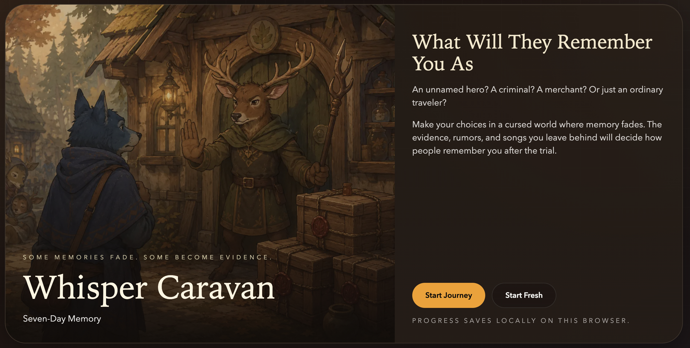

# Whisper Caravan



**Whisper Caravan** is a narrative choice game about memory, rumor, survival, and judgment.

They say you did something wrong.
You have **14 days** before Bear Court arrives.

On the road, you will pass through Deer Village, Fox Market, the refugee camp, the Crow Brokers, and Bear Court. Each day brings one decisive event. Every choice changes who you meet, what evidence you leave behind, and how NPCs remember you.

But this world is cursed.

NPCs keep only **seven days** of direct memory. A kindness may fade. A witness may forget. Yet records, contracts, rumors, and songs survive — and become the way the world remembers you.

## Play Online

[Play Whisper Caravan](https://whisper-caravan-seven-day.vercel.app/)

*(Note: For the best experience, please use a desktop browser. Mobile experience optimization is currently ongoing.)*

## Highlights

* **14-day narrative run** with one major event per day
* **Route-dependent events** shaped by your choices
* **NPC attitude changes** based on trust, risk, and evidence
* **Seven-day memory system** where short-term memories fade
* **Evidence system** built around records, contracts, rumors, and songs
* **Multiple endings** decided by what the world remembers

## Architecture & AI Integration

Whisper Caravan is engineered as a production-grade showcase for advanced game AI integration:

* **RAG-powered NPCs**: Utilizes an asynchronous hybrid RAG pipeline (SQLite + Chroma Vector DB) to query and retrieve player memories, rumors, and evidence dynamically. NPCs' response in week 2 is dynamically generated based on the semantic relevance, reliability, and visibility scopes of the retrieved context.
* **Multi-Agent Response Framework**: Implements strict schema validation and deterministic boundary clamping between LLM dialogue generation and core game states. This safeguards the gameplay loop (trust deltas, shop prices, route unlocks) from hallucinations while maintaining high-fidelity generative roleplay.

For a detailed breakdown of the AI mechanics and architecture, see [docs/GAME_AI_DESIGN.md](docs/GAME_AI_DESIGN.md).

## Run Locally

```bash
npm install
npm run dev
```

Then open the local URL shown in your terminal.

## Originality & Licensing / 原创声明与授权

* **Originality**: This project, including all narrative design, custom mechanics, and source code, is an original work.
* **Commercial Use Prohibited**: Any form of commercial use, reproduction, distribution, or monetization of this project or its assets is strictly prohibited without explicit written permission.
* **原创声明**：本项目的全部叙事设计、核心机制及源代码均为原创作品。
* **商业限制**：未经明确书面授权，严禁将本项目或其任何素材用于任何形式的商业化用途。
