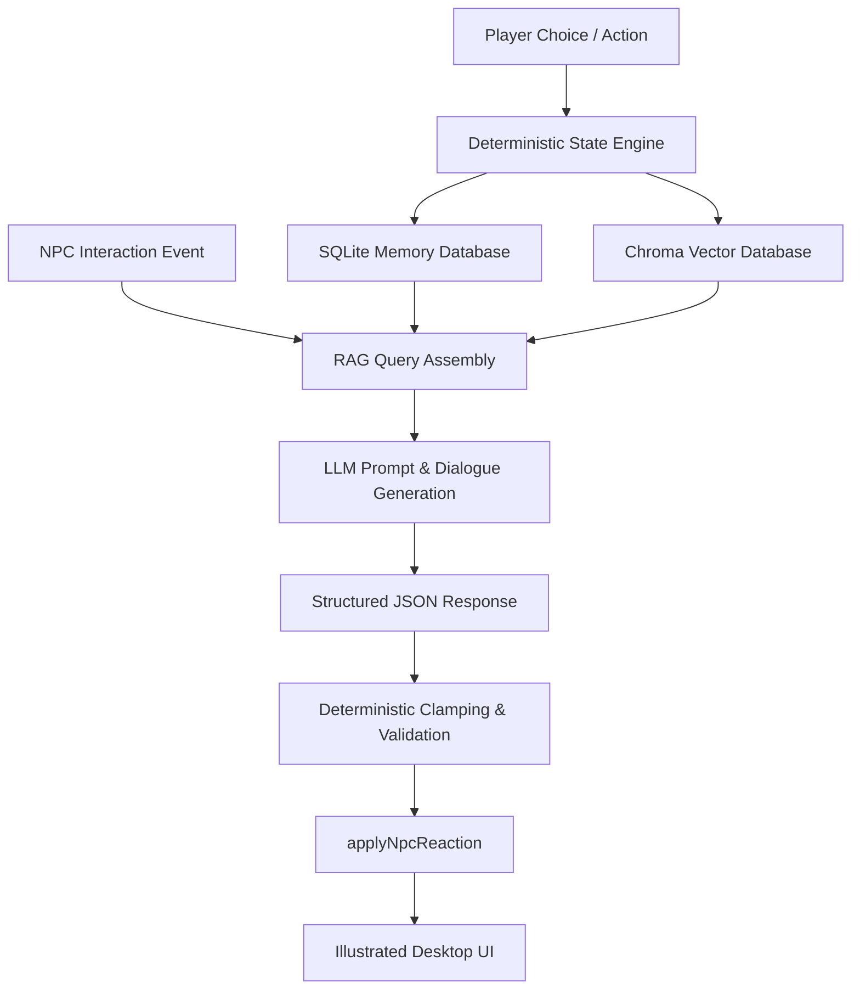

# Whisper Caravan: Advanced Game AI & RAG Memory Systems

Whisper Caravan is designed not only as a narrative experience but as a reference architecture for integrating modern context-aware dialogue engines, state validation boundaries, and flexible prompt orchestration into stateful game loops. 

This document provides a deep dive into the underlying architecture, explaining how semantic memory retrieval, validation guardrails, and environment-driven fallbacks combine to create intelligent, reactive game characters.

---

## 1. Architecture Overview: Hybrid State & Generative Loop

In traditional game development, NPC interactions are governed by complex, hardcoded branching dialog trees. In contrast, Whisper Caravan utilizes a **hybrid architecture** that combines a deterministic game engine with a generative AI layer.



### The Separation of Concerns
1. **Generative Layer (Dialogue & Tone)**: The LLM is responsible *only* for natural language generation (dialogue) and stylistic performance (tone, explanation).
2. **Deterministic Layer (State & Balances)**: The local game state engine ([gameLogic.ts](file:///Users/haolong/Documents/seven%20days/lib/gameLogic.ts)) validates, clamps, and executes all gameplay modifications (trust deltas, route unlocks, and inventory/resource modifiers). This prevents "hallucination exploits" where an LLM could erroneously award the player infinite items or unlock illegal states.

---

## 2. Context-Aware Dialogue & Semantic Memory Retrieval

Whisper Caravan implements a dual-database storage strategy to simulate human-like cognition (short-term fading vs. long-term persistence):

* **Structured State Database (SQLite)**: Acts as the absolute source of truth for game state, active memory tracking, and physical inventory.
* **Semantic Index (Chroma DB)**: Houses vector representations of the player’s history, including choices, rumors, and recorded evidence, indexed via sentence-transformer embeddings.

### Query Construction & Prompt Context
When the player encounters an NPC, a query text is dynamically generated based on the NPC’s memory access profile. For example:
- A merchant NPC like the **Fox Ledger Master** searches for contracts and ledger records.
- A rumor broker like the **Crow Broker** searches for songs, hearsay, and public gossip.

The RAG pipeline compiles candidate memories using a query text built from:
1. The NPC's faction affinity and identity tokens.
2. The player's active location and elapsed time.
3. Reliability constraints (e.g., dismissing evidence below a specific reliability score).

```python
# Example of RAG Query Construction in backend/app/retrieval.py
def build_structured_reaction_query_text(request: StructuredReactionRequest) -> str:
    parts: List[str] = [
        "structured",
        "reaction",
        "day",
        str(request.day),
        "npc",
        request.npc_id,
        "route",
        request.route,
        "player_input",
        request.player_input
    ]
    return " ".join(part for part in parts if part)
```

By querying the vector database with this structured context, the system retrieves only the memories semantically relevant to the current interaction, which are then injected directly into the LLM prompt.

---

## 3. Structured State Guardrails for Generative Characters

Every intelligent NPC is represented by a structured access profile ([structured_reaction.py](file:///Users/haolong/Documents/seven%20days/backend/app/structured_reaction.py)) specifying:
* **Allowed Memory Types**: What types of memories (e.g., `record`, `testimony`, `rumor`) the NPC can retrieve.
* **Minimum Reliability**: The trust threshold below which the NPC will ignore evidence.
* **Access Scopes**: Whether the NPC can read private logs or is restricted to public rumors.

### Validation & Clamping Boundary
When an LLM returns a structured JSON payload, it goes through strict local schema validation and clamping:

```typescript
// Clamping bounds applied deterministically:
trust_delta: number;        // Clamped strictly between -10 and +10
legal_risk_delta: number;   // Clamped strictly between -20 and +20
price_modifier: number;     // Clamped strictly between 0.5 and 1.5
route_unlocks: string[];    // Restricted to predefined valid routes (e.g., "truth", "merchant")
```

This hybrid approach ensures high-fidelity roleplay while keeping game design balances completely predictable.

---

The dialogue prompt context isolates stylistic details:
```json
{
  "npc_id": "camp_healer",
  "player_input": "Deliver the medical supplies",
  "route": "truth",
  "evidence": [
    {
      "memory_id": "healer_01",
      "title": "Apothecary Ledger Entry",
      "type": "record"
    }
  ],
  "fallback_tone": "sympathetic"
}
```

---

## 5. Extensibility to Strategic Agent Systems & AIGC Level Gen

The design patterns established in Whisper Caravan easily scale to more complex gaming environments:

* **Strategic Multi-Agent Systems**: By expanding the access profiles into independent agents with unique goal states, NPCs can negotiate with one another, trade evidence, and form dynamic alliances based on retrieved memories.
* **AIGC Level & Quest Generation**: The same RAG query logic can be used to scan past player choices and dynamically construct new game scenes, quests, or procedurally generated levels tailored to the player's historical behavior and reputation.
